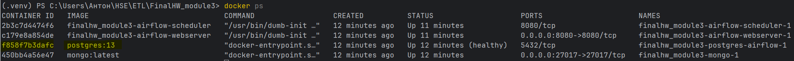

Итоговое ДЗ по ETL по модулю 3.

Запуск всего нужного в докере:
docker-compose up -d

После чего надо сгенерировать данные в MongoDB с помощью запуска mongo/entities/generate_data.py
По итогу у нас будет:
1. UserSessions, сессии пользователей:
 - session_id — уникальный идентификатор сессии;
 - user_id — идентификатор пользователя;
 - start_time — время начала сессии;
 - end_time — время завершения сессии;
 - pages_visited — массив посещённых страниц;
 - device — информация об устройстве;
 - actions — массив действий пользователя.

2. ProductPriceHistory, история изменения цен:
 - product_id — идентификатор товара;
 - price_changes — массив изменений цен с датами;
 - current_price — текущая цена;
 - currency — валюта.

3. EventLogs, логи событий:
 - event_id — уникальный идентификатор события;
 - timestamp — время события;
 - event_type — тип события;
 - details — подробности.

 4. SupportTickets, обращения в поддержку:
 - ticket_id — уникальный идентификатор тикета;
 - user_id — идентификатор пользователя;
 - status — статус тикета;
 - issue_type — тип проблемы;
 - messages — массив сообщений;
 - created_at — время создания тикета;
 - updated_at — время последнего обновления.

5. UserRecommendations, рекомендации пользователям:
 - user_id — идентификатор пользователя;
 - recommended_products — массив рекомендованных товаров;
 - last_updated — время последнего обновления рекомендаций.

6. ModerationQueue, очередь модерации отзывов:
 - review_id — идентификатор отзыва;
 - user_id — идентификатор пользователя;
 - product_id — идентификатор товара;
 - review_text — текст отзыва;
 - rating — оценка;
 - moderation_status — статус модерации;
 - flags — массив флагов;
 - submitted_at — время, когда был оставлен отзыв.

7. SearchQueries, поисковые запросы:
 - query_id — уникальный идентификатор запроса;
 - user_id — идентификатор пользователя;
 - query_text — текст запроса;
 - timestamp — время запроса;
 - filters — применённые фильтры;
 - results_count — количество найденных результатов.

В каждой сущности сгенерированы примеры(В конце generate_data.py также выводится количество записей в таблицах и первые 2 записи для просмотра)

Далее необходимо создать таблицы в PostgreSQL

Во-первых, нужно выполнить docker ps, должны получить что-то типа:  

Из этого нам необходимо взять CONTAINER ID у postgres, в данном примере f858f7b3dafc.

Выполняем: docker exec -it f858f7b3dafc psql -U airflow -d airflow
С помощью этой команды мы заходим внутрь PostgreSQL, чтобы создать таблицы из файла postgre/create_tables.sql

Далее, заходим по ссылке http://localhost:8080 в airflow
Там будет DAG с названием mongo_to_postgres_replication
Для ручного запуска справа в Actions необходимо запустить Trigger DAG
После выполнения задания можно зайти в LOG таски, чтобы проверить успешность выполнения репликации. В корректном случае вывод будет следующим(Пример):
[2025-03-14, 16:27:26 UTC] {logging_mixin.py:137} INFO - Репликация UserSessions -> user_sessions завершена. Записей: 1300
[2025-03-14, 16:27:26 UTC] {logging_mixin.py:137} INFO - Репликация ProductPriceHistory -> product_price_history завершена. Записей: 600
[2025-03-14, 16:27:26 UTC] {logging_mixin.py:137} INFO - Репликация EventLogs -> event_logs завершена. Записей: 2400
[2025-03-14, 16:27:26 UTC] {logging_mixin.py:137} INFO - Репликация SupportTickets -> support_tickets завершена. Записей: 1100
[2025-03-14, 16:27:27 UTC] {logging_mixin.py:137} INFO - Репликация UserRecommendations -> user_recommendations завершена. Записей: 330
[2025-03-14, 16:27:27 UTC] {logging_mixin.py:137} INFO - Репликация ModerationQueue -> moderation_queue завершена. Записей: 500
[2025-03-14, 16:27:27 UTC] {logging_mixin.py:137} INFO - Репликация SearchQueries -> search_queries завершена. Записей: 450
[2025-03-14, 16:27:27 UTC] {python.py:177} INFO - Done. Returned value was: None
[2025-03-14, 16:27:27 UTC] {taskinstance.py:1323} INFO - Marking task as SUCCESS. dag_id=mongo_to_postgres_replication, task_id=replicate_all_collections, execution_date=20250314T162724, start_date=20250314T162726, end_date=20250314T162727
[2025-03-14, 16:27:27 UTC] {local_task_job.py:208} INFO - Task exited with return code 0
[2025-03-14, 16:27:27 UTC] {taskinstance.py:2578} INFO - 0 downstream tasks scheduled from follow-on schedule check
